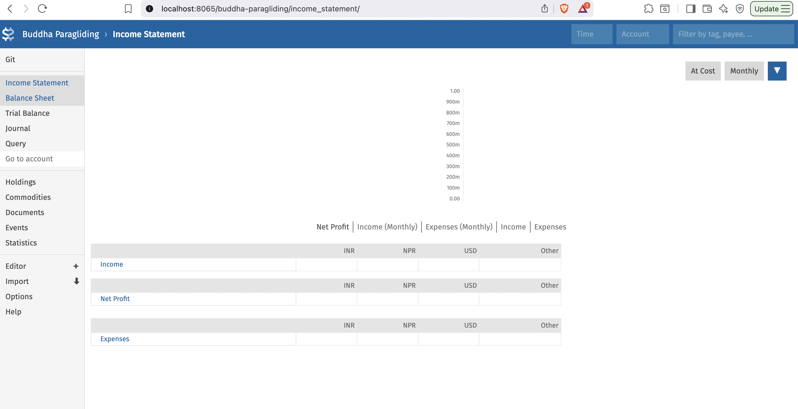
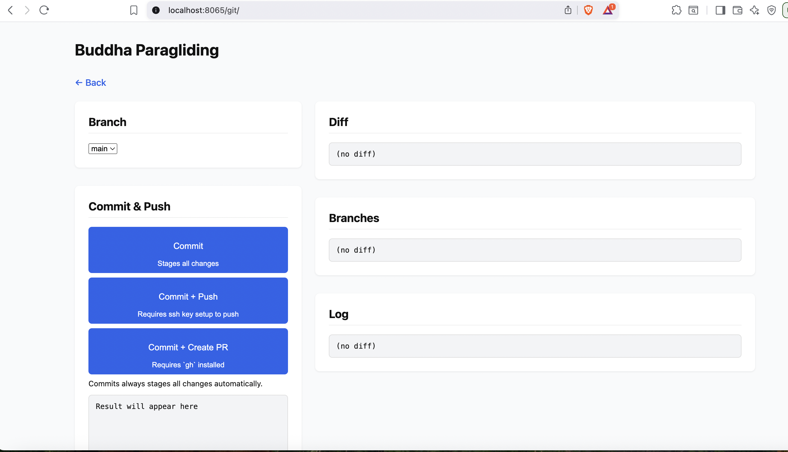

**bean-docker:**

This is a project that makes it easier to run Beancount via docker, plus an integration with git/github so
that you have easy backup/version-control of your accounting data/software.

[**Beancount**](https://github.com/beancount/beancount) is a plain-text, accounting software. One of my most
favorite features of beancount is that it is (or say, can be) a tamper-proof accounting software when you
use it with git and github. Just commit your changes and push them to github. However git and github, and
even beancount are only (easily) accessible to developers. This project makes it easier for non-developers
to also reap the benefits of beancount by providing a docker image for easy installation and bundling it
with a basic git server where you can run basic git commands as well as push your changes to github for
easy backup from a website, i.e. without you having to go to the command line or some code editing software.

This docker compose bundles two services and uses an nginx reverse proxy to serve them both on the same host:port under different paths:

1. [Fava](https://github.com/beancount/fava) (Web based GUI for beancount)
1. GW(https://github.com/sumanchapai/gw) (Web interface that provides basic Git and functionalities)

**Fava running on the root route:**

**Git Web (GW) running on the `/git` route:**

If you want to create a project, here are the steps:

1. Have Docker installed in your system.
1. Create a file named `compose.yaml` (preferably in an empty folder) and copy the contents from [compose.yaml](./compose.yaml).
1. Create a `.env` file (alongside `compose.yaml`) with contents from [.env.example](.env.example) and update the environment variables
   as necessary. You can find instructions on how to set github repo token [here](https://github.com/sumanchapai/gw?tab=readme-ov-file#generating-github-token)
   which is needed for you to be able to push to github.
1. Run `docker compose up` and you should have your beancount ready to use with git support at
   `localhost:8063` or whatever port you've defined in the environment file.
